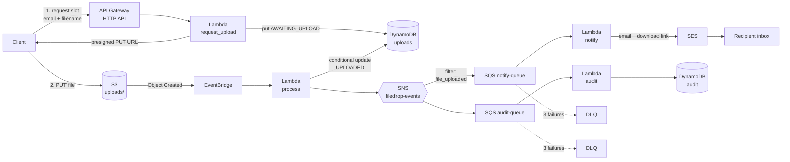
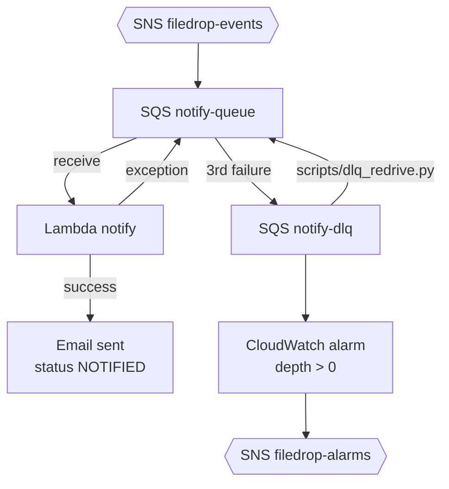

# Filedrop

**Serverless file delivery on AWS — presigned S3 uploads, event-driven processing, SES-delivered download links.**

[](.github-workflows-templates/filedrop-ci.yml)
[](pyproject.toml)
[](LICENSE)

## Architecture



## The numbers

Populated by `scripts/load_test.py` against a deployed stack. Values are TBD
until a load-test run is committed.

| Metric | Value |
|---|---|
| End-to-end latency (upload complete → email sent), p50 | _TBD_ |
| End-to-end latency, p95 | _TBD_ |
| End-to-end latency, p99 | _TBD_ |
| Successful deliveries per 100 attempts | _TBD_ |
| Duplicate events suppressed by conditional writes | _TBD_ |
| Cold-start p95 (process Lambda) | _TBD_ |

Reproduce with `make load-test` after `make deploy` (see [Run it yourself](#run-it-yourself)).

## How it works

- **Request** — Client `POST /uploads` with `{email, filename, content_type, size_bytes}`. The `request_upload` Lambda validates fields (email regex, filename allowlist + path-traversal guard, size ≤ 25 MB) and writes an `AWAITING_UPLOAD` row to DynamoDB with a 48-hour TTL.
- **Presign** — Server responds `201` with a 15-minute presigned `PUT` URL signed for `uploads/{upload_id}/{filename}` with the declared Content-Type pinned into the signature.
- **Upload** — Client `PUT`s the file directly to S3. Nothing else touches the payload; the API Lambda never sees it.
- **Fan-out** — S3 emits `Object Created` to EventBridge; a rule with a `uploads/` prefix filter routes to the `process` Lambda.
- **Verify + gate** — `process` HEADs the object, re-checks size + extension, and does a *conditional* `UpdateItem` that only fires when `status = AWAITING_UPLOAD`. Duplicate S3/EventBridge deliveries hit that condition and log `duplicate_event_suppressed`.
- **Publish** — `process` publishes to SNS `filedrop-events` with a `event_type` message attribute. SNS fans out to two SQS queues.
- **Notify** — `notify-queue` (filter `event_type=file_uploaded`) drives the `notify` Lambda: presigned 24-hour GET URL + SES email (text + HTML) with the link, size, content type, and explicit expiry timestamp.
- **Audit** — `audit-queue` (no filter, all events) drives the `audit` Lambda: append-only rows to the `filedrop-audit` DynamoDB table keyed by `upload_id` + `event_timestamp`.

## Design decisions

Each has a full ADR in [docs/adr/](docs/adr/).

### CDK over SAM ([001](docs/adr/001-cdk-over-sam.md))
CDK's L2 constructs collapse boilerplate (SNS-to-SQS with filter policies, EventBridge rules, IAM grants) into one-liners, and Python-based infrastructure keeps the whole project in one language.

### SES over SNS for user email ([002](docs/adr/002-ses-over-sns-for-user-email.md))
SNS email requires the recipient to click a subscription-confirmation link — unusable for transactional email to arbitrary addresses. SES's sandbox restriction is real (recipients must be verified until production access is granted) but is documented and reversible.

### EventBridge over direct S3 notifications ([003](docs/adr/003-eventbridge-over-s3-notifications.md))
EventBridge lets us filter events by prefix + object attributes at the routing layer, target multiple consumers, and get archive/replay for free. Direct S3 notifications pin us to a single target per event.

### Idempotency via conditional writes ([004](docs/adr/004-idempotency-via-conditional-writes.md))
S3 and EventBridge deliver at-least-once. Rather than build a dedup table, we use the existing status transitions (`AWAITING_UPLOAD → UPLOADED → NOTIFIED`) as the dedup gate via DynamoDB `ConditionExpression`. Duplicate events fail the condition, log, and exit cleanly.

### Presigned PUT with server-side size enforcement ([005](docs/adr/005-presigned-upload-strategy.md))
Presigned POST would let us enforce `content-length-range` in the signature. We chose PUT for simpler client integration and re-check actual size in the `process` Lambda — quarantining oversize uploads and rejecting them.

## Failure handling



- **SQS retries.** `notify-queue` and `audit-queue` each have `maxReceiveCount=3`. On the fourth attempt, the message lands in a DLQ (`filedrop-notify-dlq`, `filedrop-audit-dlq`).
- **EventBridge DLQ.** If EventBridge can't invoke the `process` Lambda (throttling, IAM change, deploy race), the event lands in `filedrop-eventbridge-dlq` rather than being dropped.
- **CloudWatch alarms.** Every DLQ has a `depth > 0` alarm that pages via the `filedrop-alarms` SNS topic (email endpoint set via `alarmEmail` context var).
- **Redrive.** `scripts/dlq_redrive.py` pulls a batch off a DLQ and re-sends to the source queue, preserving message attributes. Example dry-run:
  ```bash
  python scripts/dlq_redrive.py --queue filedrop-notify-dlq --limit 50 --dry-run
  ```
  Drop `--dry-run` to actually move them. Deletes from the DLQ only after a successful send, so a crash mid-run leaves messages safely on the DLQ.
- **Poison-file test.** Upload a `.exe` (blocked at the API) or bypass the API and PUT a 40 MB file — the `process` Lambda tags the object `quarantine=true`, marks the DynamoDB row `REJECTED`, and publishes a `file_rejected` event. The `audit` Lambda still records it; `notify` doesn't fire.

## Run it yourself

### Prerequisites
- Python 3.12
- AWS account with credentials configured (`aws configure` or SSO)
- CDK v2 CLI: `npm install -g aws-cdk@2`
- CDK bootstrapped in your target region: `cdk bootstrap`
- (optional) [`uv`](https://docs.astral.sh/uv/) for faster installs; `pip` fallback works too
- An email address for SES sender identity (must be verified via the confirmation email SES sends)

### Setup
```bash
cd filedrop-aws
cp cdk.context.json.example cdk.context.json  # edit region / senderEmail / alarmEmail
make install
```

### Verify + build
```bash
make lint         # ruff check + format check
make typecheck    # mypy
make test         # pytest tests/unit
make synth        # cdk synth — produces cdk.out/ CloudFormation
```

### Deploy
```bash
export SENDER_EMAIL=you@example.com
make deploy
```
CDK will provision two stacks: `FiledropCoreStack` (bucket, tables, SNS, SQS, Lambdas, EventBridge) and `FiledropApiStack` (HTTP API + `request_upload` Lambda).

**SES sandbox note.** New AWS accounts start in SES sandbox mode: you can only send to verified email addresses, and you're capped at 200 emails/day. To go live, [request production access](https://docs.aws.amazon.com/ses/latest/dg/request-production-access.html) from the SES console. Until then, every recipient of a Filedrop email must be verified via the SES console.

### Exercise it
```bash
export FILEDROP_API_URL=https://xxx.execute-api.ap-south-1.amazonaws.com
export TEST_EMAIL=you@example.com   # must be SES-verified in sandbox
make load-test
```

### Tear it down
```bash
make destroy
```
Both stacks are `RemovalPolicy.DESTROY` — buckets and tables are dropped with the stacks. No lingering charges.

## Links

- Portfolio: [kunalships.dev](https://kunalships.dev) *(placeholder)*
- Author: [Kunal Kejriwal on GitHub](https://github.com/kunalkejriwal) *(placeholder)*
- License: MIT
