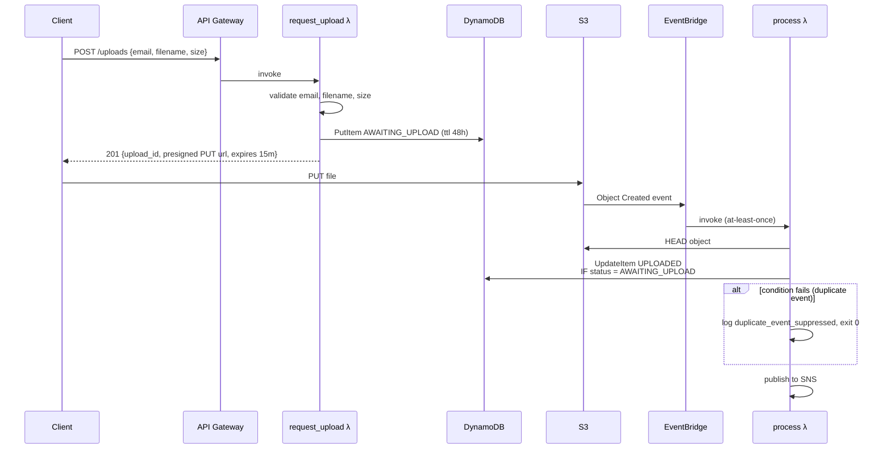

# Filedrop — architecture

## Upload sequence



## Stacks

- **FiledropCoreStack** — S3 uploads bucket, DynamoDB `uploads` + `audit` tables, SNS `filedrop-events` + `filedrop-alarms`, notify/audit SQS queues (+ DLQs), EventBridge DLQ, EventBridge rule, process/notify/audit Lambdas, SES sender identity.
- **FiledropApiStack** — API Gateway HTTP API + `request_upload` Lambda. Depends on the uploads bucket + table from the core stack (imported via CDK cross-stack refs).

Splitting this way lets the public surface iterate independently of the storage/event plumbing, and keeps blast radius small on `cdk deploy`.

## IAM policy per Lambda

Every grant is scoped to the specific action(s) and resource(s) the Lambda needs. See the inline comments in [`infra/core_stack.py`](../infra/core_stack.py) and [`infra/api_stack.py`](../infra/api_stack.py) for the reasoning on each grant.

| Lambda | Permissions |
|---|---|
| `request_upload` | `dynamodb:PutItem` on uploads table; `s3:PutObject` on `bucket/uploads/*` (needed to presign PUT URLs) |
| `process` | `s3:GetObject`, `s3:PutObjectTagging` on `bucket/uploads/*`; `dynamodb:UpdateItem` on uploads table; `sns:Publish` on events topic |
| `notify` | `s3:GetObject` on `bucket/uploads/*`; `dynamodb:GetItem`/`UpdateItem` on uploads table; `ses:SendEmail`/`SendRawEmail` scoped to the configured sender identity |
| `audit` | `dynamodb:PutItem` on audit table |

None have `*` resources. Every Lambda has X-Ray tracing enabled and uses aws-lambda-powertools for structured JSON logging.

## Lambda packaging

Each function is bundled by CDK via `lambda.Code.from_asset(..., bundling=...)`, which runs a `pip install` of `aws-lambda-powertools` into `/asset-output` alongside the function code and the shared `shared/` package. For a production-scale project this should move to a Lambda layer to shrink deployment artifacts — noted here rather than done because the portfolio project benefits from single-command deploys.

## Observability

- **Logs.** Every Lambda uses `aws_lambda_powertools.Logger` — structured JSON, one line per log event, correlation via the `upload_id` key added with `logger.append_keys(...)`.
- **Traces.** X-Ray `ACTIVE` on every Lambda. Boto3 clients are auto-instrumented via powertools' `Tracer.capture_lambda_handler`.
- **Metrics.** The DLQ depth alarms (`{Notify,Audit,EventBridge}DlqDepthAlarm`) fire into `filedrop-alarms` SNS on `depth > 0`. Extend with Lambda error-rate alarms in a future iteration if this grows past portfolio scope.

## GitHub OIDC trust policy

The deploy workflow uses GitHub's OIDC provider — no long-lived access keys. Create an IAM role in AWS with this trust policy (edit the placeholders):

```json
{
  "Version": "2012-10-17",
  "Statement": [
    {
      "Effect": "Allow",
      "Principal": {
        "Federated": "arn:aws:iam::REPLACE_ACCOUNT_ID:oidc-provider/token.actions.githubusercontent.com"
      },
      "Action": "sts:AssumeRoleWithWebIdentity",
      "Condition": {
        "StringEquals": {
          "token.actions.githubusercontent.com:aud": "sts.amazonaws.com"
        },
        "StringLike": {
          "token.actions.githubusercontent.com:sub": "repo:kunalkejriwal/kunalships:ref:refs/heads/main"
        }
      }
    }
  ]
}
```

**EDIT ME**: replace `REPLACE_ACCOUNT_ID` and the `kunalkejriwal/kunalships` repo path with your own. The `sub` claim restricts assumption to the main branch — narrower than `repo:kunalkejriwal/kunalships:*` which would allow any branch/PR.

Attach a policy to the role granting the minimum CloudFormation + service actions needed for `cdk deploy` (S3, DynamoDB, SNS, SQS, Lambda, IAM, API Gateway v2, EventBridge, SES, CloudWatch, X-Ray). For a portfolio project, `PowerUserAccess` + `IAMFullAccess` gets you there fast; tighten in production.

## Cost sketch

At portfolio-scale usage (a few dozen uploads/day):
- DynamoDB on-demand: pennies/month
- S3: sub-cent/month (7-day lifecycle on uploads)
- Lambda: free-tier
- SES: $0.10 per 1,000 emails (free tier: 62k/month for EC2/Lambda-originated)
- API Gateway HTTP API: free tier covers first 1M requests
- CloudWatch logs: watch this one — set a log-group retention if it grows

## Regions

Default region is `ap-south-1` (Mumbai) via CDK context. Override with `--context region=us-east-1` on `cdk deploy` or by editing `cdk.context.json`.
